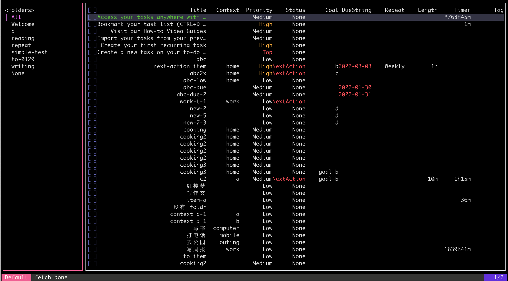

# go-toodledo

[](https://github.com/alswl/go-toodledo/actions/workflows/go.yml/badge.svg)
[](https://goreportcard.com/report/github.com/alswl/go-toodledo)

Go CLI / TUI / SDK for Toodledo.

Status: CLI Stable / SDK Stable / TUI under development(did NOT continue)

I’ve used Toodledo for over twelve years now paying eight years’ subscription fees.
Now I migrate to Obsidian Tasks. Read
[From Toodledo To Obsidian Tasks - my GTD best practices | Log4D](https://en.blog.alswl.com/2023/02/gtd/)
for more details.

## Usage (CLI)

```sh
> toodledo task list --context home --status nextaction
         # │ [X] │ TITLE            │     STATUS │ CONTEXT │ PRIORITY │ FOLDER  │ GOAL │ DUE        │ REPEAT      │ LENGTH │ TIMER
───────────┼─────┼──────────────────┼────────────┼─────────┼──────────┼─────────┼──────┼────────────┼─────────────┼────────┼───────
 327077755 │ [ ] │ next-action item │ NextAction │ home    │     High │ to-0128 │ b    │ 2022-02-24 │ FREQ=WEEKLY │ 1m0s   │ 20m0s
 327078471 │ [ ] │ abc2x            │ NextAction │ home    │     High │         │ c    │            │             │        │
```

More commands usage can be found in the [Manual](./docs/commands/toodledo.md).

### Quick Start

Login:

```sh
# login
toodledo auth login
# follow steps, open link your browser
toodledo auth token YOUR-CODE
# verify
toodledo auth status
```

Tasks:

```shell
# list
> toodledo task list --context home --goal goal-b
INFO[0002] Syncing tasks
         # │ [X] │ TITLE    │ STATUS │ CONTEXT │ PRIORITY │ FOLDER │ GOAL   │ DUE │ REPEAT │ LENGTH │ TIMER
───────────┼─────┼──────────┼────────┼─────────┼──────────┼────────┼────────┼─────┼────────┼────────┼───────
 330000079 │ [ ] │ cooking3 │   None │ home    │   Medium │        │ goal-b │     │        │        │

# complete
> toodledo task complete 323245685
         # │ [X] │ TITLE  │ STATUS │ CONTEXT │ PRIORITY │ FOLDER  │ GOAL    │ DUE │ REPEAT │ LENGTH │ TIMER
───────────┼─────┼────────┼────────┼─────────┼──────────┼─────────┼─────────┼─────┼────────┼────────┼───────
 320000085 │ [X] │ test-c │   None │ Not Set │      Low │ Not Set │ Not Set │   0 │        │      0 │     0

# edit
> toodledo task edit --title cooking4-8 --context a --status nextaction 334313701
         # │ [X] │ TITLE      │     STATUS │ CONTEXT │ PRIORITY │ FOLDER │ GOAL   │ DUE │ REPEAT │ LENGTH │ TIMER
───────────┼─────┼────────────┼────────────┼─────────┼──────────┼────────┼────────┼─────┼────────┼────────┼───────
 330000001 │ [ ] │ cooking4-8 │ NextAction │ a       │   Medium │ a      │ goal-b │     │        │        │
```

Goals:

```sh
> toodledo folder list
       # │ NAME                         │ ARCHIVED
─────────┼──────────────────────────────┼──────────
 3000096 │ AnalysisDesign               │        0
 4000073 │ Business                     │        0
 4000039 │ Custom-Support               │        1
 3000006 │ Coding                       │        0
 3000000 │ Family                       │        0
```

More commands usage can be found in the [Manual](./docs/toodledo.md).

## Build

```sh
> git clone https://github.com/alswl/go-toodledo.git
> make clean build
> cp ./bin/toodledo /usr/local/bin
> cp ./bin/tt /usr/local/bin
> toodledo --help
```


## One more thing

`tt` is a full-featured TUI app(under actively development).
You can get the development version from `cmd/tt`.


